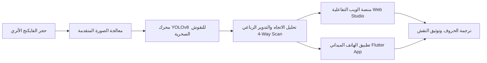

# ⚔️ منظومة استنطاق نقوش الفايكنج بالذكاء الاصطناعي
### *Viking Epigraphy AI: Decoding Ancient Runes from Stone to Modern Vision*

<div align="center">


</div>

---

## 📜 بيان الملحمة ورؤية المشروع

> **"إن شعب الفايكنج القتالي لا يخفى على أحدٍ تاريخهم الملحمي وسطوتهم التي جابت البحار، لكن تاريخهم الحقيقي وأسرارهم الروحية وفلسفتهم العميقة ظلت لقرونٍ طوال حبيسة الصخور الصامتة والوثائق القديمة، تتآكل بفعل الرياح والزمن. ومن هذا المنطلق، كرسنا كامل جهدنا وعزمنا الهندسي لابتكار وتدريب نموذج ذكاء اصطناعي ثوري فائق الدقة، يبعث الروح في تلك النقوش الصخرية (Runestones)، ويتعرف على حروف الأبجدية الرونية القديمة ورموزها بكل كفاءة واقتدار؛ لننقل التاريخ من عتمة الأحجار الأثرية إلى فضاء المعرفة الرقمية المعاصرة."**

---

## 🏛️ نظرة عامة على النظام

مشروع متكامل يجمع بين **الرؤية الحاسوبية المتقدمة (Computer Vision)** وعلم **النقوش الأثرية (Epigraphy)**، بهدف استكشاف وفك شيفرات الأبجدية الرونية ونقوش الفايكنج الأثرية بدقة متناهية تحت مختلف ظروف الإضاءة والتآكل الجيولوجي.



---

## ⚡ أبرز المكونات المعمارية للمشروع

### 1. 🧠 نواة الرؤية الحاسوبية والذكاء الاصطناعي (AI Core)
- **نماذج YOLOv8 المدربة خصيصاً على النقوش (Epigraphy-Tuned YOLO):** تدريب عميق لاكتشاف أدق التجاويف الصخرية التي تمثل حروف الفايكنج.
- **الماسح الضوئي متعدد الاتجاهات (4-Way Rotational Scanner):** خوارزمية ذكية لمسح الحجر بزوايا تدوير مختلفة لضمان اكتشاف النقوش العمودية والمائلة وتلك المكتوبة بطريقة البوستروفيدون (Boustrophedon).
- **أنابيب التدريب والضبط الدقيق (Fine-Tuning Pipelines):** دفاتر Google Colab و سكربتات التدريب المحلية الجاهزة لإعادة الضبط على أحجار أثرية جديدة.

### 2. 🎨 استوديو التوسيم الأثري المتخصص (Labeling Studio)
- استوديو ويب مخصص (`01_Labeling_Studio/index.html`) صُمم خصيصاً لعلماء الآثار ومطوري الرؤية الحاسوبية لتوسيم الحروف الرونية بدقة على الصخور مع ربطها بمعجم الرموز ومعانيها التاريخية.

### 3. 🌐 منصة الويب التفاعلية (Viking Web Platform)
- واجهة ويب عصرية وسريعة (`run_web_app.py` / `backend_api.py`) تسمح برفع صور الأحجار وتحليلها لحظياً، مع إظهار المربعات المحيطة (Bounding Boxes)، ونسب الثقة (Confidence Scores)، والترجمة الحرفية لكل رمز.

### 4. 📱 تطبيق الهاتف الذكي الميداني (Cross-Platform Mobile App)
- تطبيق جوال مبني بإطار عمل **Flutter** (`viking_rune_app`) مخصص للمستكشفين الميدانيين في المتاحف والمواقع الأثرية، يدعم الكشف الحي عبر الكاميرا والتعرف الفوري بدون الحاجة لاتصال مستمر.

---

## 📂 الهيكل التنظيمي للملفات المرفوعة

تم استبعاد ملفات الأوزان الضخمة والملفات المؤقتة لضمان كود نظيف وسريع:

```
├── .gitignore                             # ملف استبعاد الملفات الضخمة والمؤقتة
├── README.md                              # وثيقة المشروع والملحمة التاريخية
└── Lab 5/
    ├── backend_api.py                     # خادم واجهة البرمجة (Inference API)
    ├── run_web_app.py                     # منصة الويب التفاعلية المتكاملة
    ├── inference_full_stone.py            # محرك فحص وتجزئة الأحجار الكاملة
    ├── test_4way_rotational_scanner.py    # الخوارزمية الرباعية لتدوير الصخور وفحصها
    ├── train_finetune.py                  # سكربت تدريب وضبط الموديل المتقدم
    ├── eval_per_class.py                  # تقييم دقة كل فئة رونية بشكل منفصل
    ├── classes.txt                        # معجم الفئات الرونية المعتمدة
    ├── viking_rune_classes.txt            # تفاصيل الحروف ومعانيها التاريخية
    ├── start_viking_web_platform.bat      # تشغيل فوري لمنصة الويب
    ├── start_flutter_app.bat              # تشغيل تطبيق الهاتف الذكي
    ├── imagesfintune/
    │   └── 01_Labeling_Studio/            # استوديو التوسيم الاحترافي للنقوش
    │       └── index.html
    ├── viking_rune_app/                   # المشروع الكامل لتطبيق Flutter
    │   ├── lib/                           # شيفرة دارت والواجهات
    │   ├── assets/                        # الأصول والخطوط الأثرية
    │   └── pubspec.yaml                   # مكتبات التطبيق
    └── Viking_Rune_FineTune_Colab.ipynb   # دفتر التدريب السحابي على Google Colab
```

---

## 🚀 دليل التشغيل السريع (Quick Start)

### 1. تثبيت المتطلبات البرمجية
```bash
cd "Lab 5"
pip install ultralytics torch torchvision opencv-python fastapi uvicorn pillow
```

### 2. تشغيل منصة الويب للتحليل الأثري
```bash
python run_web_app.py
# أو عبر الملف التنفيذي المباشر:
start_viking_web_platform.bat
```
ثم توجه إلى متصفحك عبر الرابط: `http://localhost:8000`

### 3. تشغيل تطبيق الهاتف المحمول (Flutter)
```bash
cd "viking_rune_app"
flutter pub get
flutter run
```

---

## 🛡️ منهجية التعرف على الحروف (Runic Detection Pipeline)

1. **الالتقاط والتصفية المسبقة:** تحسين التباين الصخري وإزالة الضوضاء الناتجة عن شقوق الأحجار وعوامل التعرية الجوية.
2. **استخراج الخصائص الحافية:** التركيز على عمق الحفر الحجري للأحرف.
3. **التصنيف والتطبيع المكاني:** مطابقة شكل الرمز الروني مع فئته الصحيحة (Elder Futhark / Younger Futhark).
4. **العرض الأثري الموثق:** تقديم التقرير التحليلي للنقش مع الدلالات الصوتية والتاريخية لكل حرف.

---

<div align="center">

**"الكلمات المنقوشة على الصخر لا تموت، والذكاء الاصطناعي أعاد لها صوتها."**  
صُنِع هذا المشروع بشغف لربط عبق التاريخ العتيق بذروة الثورة الرقمية الحديثة.

</div>
